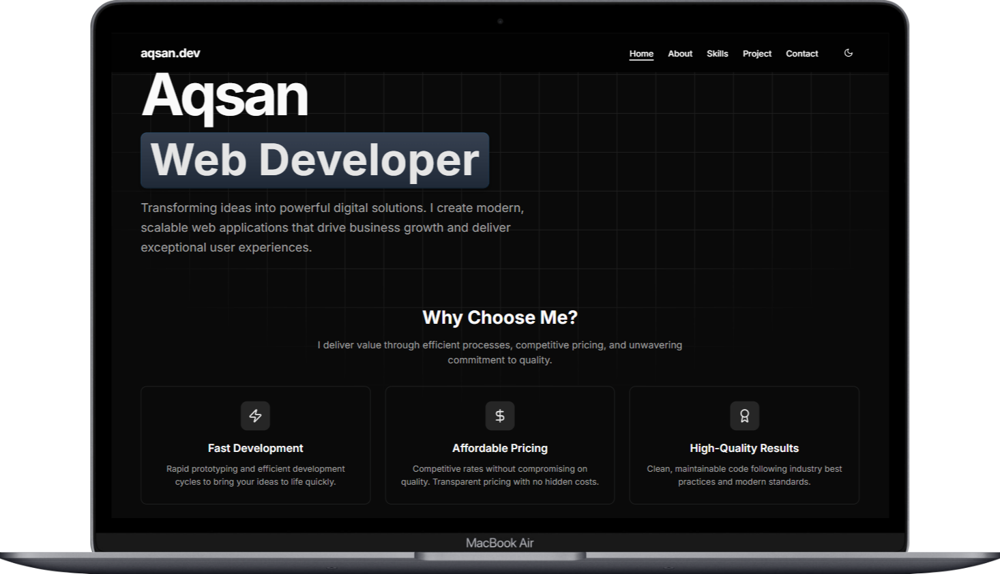

# aqsan.dev

> 🚀 Personal portfolio of Aqsan — a passionate full-stack developer from SMK RPL.

 <!-- Optional: tambahin banner kalau mau -->

## ✨ About

Hi, I'm Aqsan — a 17-year-old full-stack developer currently in vocational high school (SMK RPL). I specialize in building modern, responsive web applications using Next.js, Tailwind CSS, and various backend technologies like PHP and MySQL. This portfolio showcases my skills, projects, and growth journey.

## 🛠️ Tech Stack

- **Frontend:** HTML, CSS, JavaScript, TypeScript, React, Next.js, Tailwind CSS
- **Backend:** PHP, MySQL
- **Tools:** Git, GitHub, VS Code, Figma, Vercel

## 📁 Project Structure

```bash
.
├── app/                # App router with Next.js
├── components/         # Reusable UI components
├── public/             # Static assets
├── styles/             # Global styles
├── utils/              # Utility functions
├── README.md
└── ...
```

## 📷 Preview

 <!-- Bisa pakai vercel screenshot atau manual -->

## 📌 Features

- Fully responsive layout
- Built with Next.js App Router
- Uses shadcn/ui component library
- Clean and minimal UI
- Dark mode support _(optional)_

## 🚀 Getting Started

```bash
# Clone the repo
git clone https://github.com/NojsNojin/aqsan-dev.git

# Install dependencies
npm install

# Run development server
npm run dev
```

## 📫 Contact

Feel free to reach out:

- Portfolio: [aqsan.dev](https://aqsan.vercel.app/)
- Email: [muhammadraffiaqsan@gmail.com](mailto:your-email@mail.com)

---

> "Discipline will beat talent if talent lacks discipline." — Let's build in public.
---
